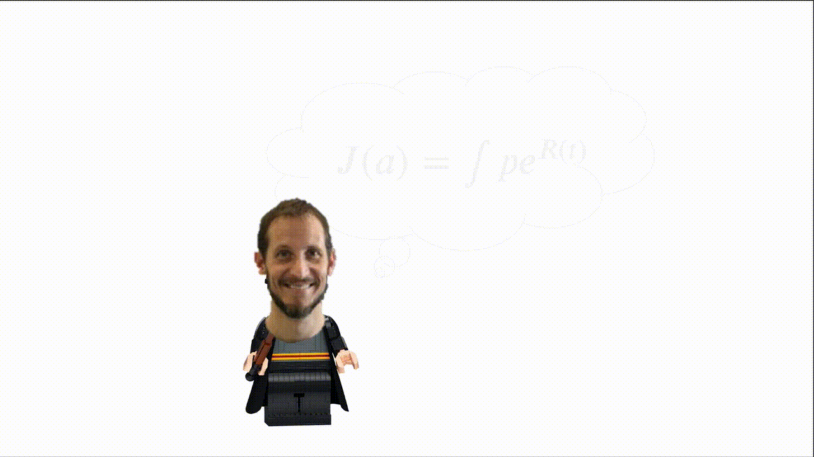

  

Het is leerling Mario! Hij voelt zich niet goed,  
want hij weet niet hoe hij deze formule naar LaTeX vertalen moet!    

Help jij hem met deze moeilijke som?   
Kies het juiste antwoord, dan lijkt hij minder dom!  

[(A) J(a) = \int pe^(R(t))](./fout.md)  
[(B) J(a) = \int {pe^R(t)}](./fout.md)  
[(C) J(a) = \int pe^{R(t)}](./mariopost.md)

